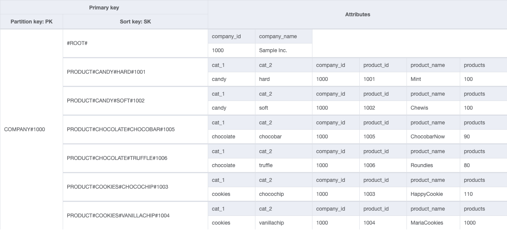
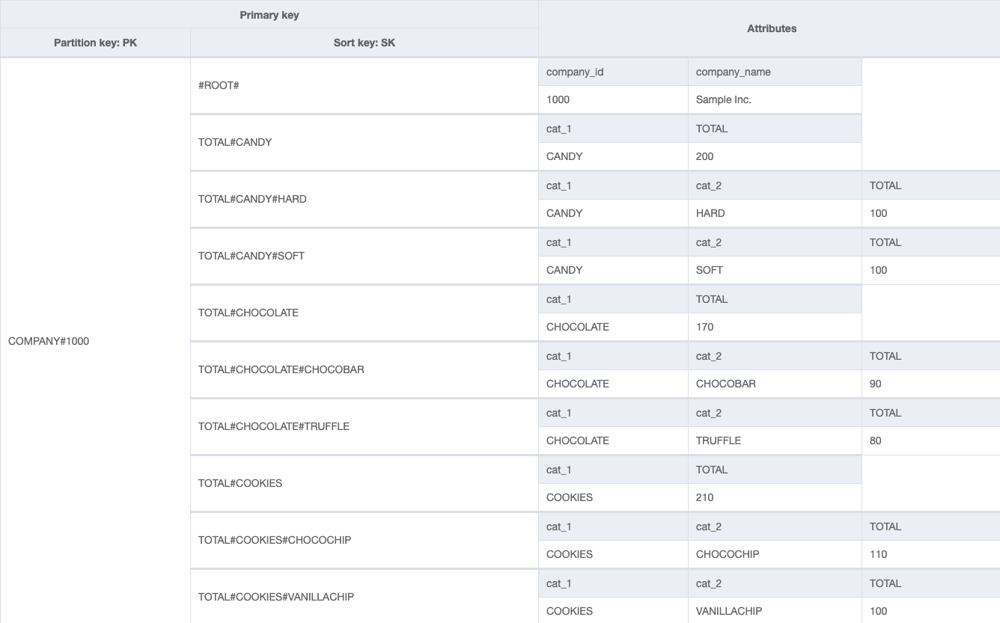

<!-- /*
 * Copyright Amazon.com, Inc. or its affiliates. All Rights Reserved.
 * SPDX-License-Identifier: MIT-0
 *
 * Permission is hereby granted, free of charge, to any person obtaining a copy of this
 * software and associated documentation files (the "Software"), to deal in the Software
 * without restriction, including without limitation the rights to use, copy, modify,
 * merge, publish, distribute, sublicense, and/or sell copies of the Software, and to
 * permit persons to whom the Software is furnished to do so.
 *
 * THE SOFTWARE IS PROVIDED "AS IS", WITHOUT WARRANTY OF ANY KIND, EXPRESS OR IMPLIED,
 * INCLUDING BUT NOT LIMITED TO THE WARRANTIES OF MERCHANTABILITY, FITNESS FOR A
 * PARTICULAR PURPOSE AND NONINFRINGEMENT. IN NO EVENT SHALL THE AUTHORS OR COPYRIGHT
 * HOLDERS BE LIABLE FOR ANY CLAIM, DAMAGES OR OTHER LIABILITY, WHETHER IN AN ACTION
 * OF CONTRACT, TORT OR OTHERWISE, ARISING FROM, OUT OF OR IN CONNECTION WITH THE
 * SOFTWARE OR THE USE OR OTHER DEALINGS IN THE SOFTWARE.
 */ -->

# Debunking Amazon DynamoDB Myths.

Welcome to this repository, this is the official github repository that will be used to share the examples shared in the twitch series "Debunking Amazon DynamoDB Myths".

This is the branch that covers the episode two.

# Episode Two - Working with triggers and Stored Procedures

During this episode we discussed about why developers like (and dislike) stored procedures and what are the options to process application logic with AWS. In simple terms there is no such a thing as stored procedures with Amazon DynamoDB but you have several options, lambda, fargate, ECS, EKS, EC2 your laptop, etc.

In this episode we also covered why is important to have a logic layer that isolates application logic from data logic, which helps with the code portability.

We have Amazon DynamoDB Streams that enables event driven architectures and can provide the same functionality that you have with triggers in traditional SQL databases, with Amazon DynamoDB streams you can build event driven architectures.

## Episode Two example - Company and products inventory use case.

Remember, in our first episode, and in general with Amazon DynamoDB we always need to start from the Access patterns! That will be always step 1

We have a big supermarket chain, that is monitoring product inventory on their locations, this chain is located across the country and have thousands of stores, where they move inventory constantly. The inventory system from each location is already under heavy load and management wants to keep a close eye on inventory to avoid shortages, at the same time they know they need a system to access data in real-time so they can make decisions with accurate data.

This system will be used by the company to order different products as inventory requires it, given the size and the nature of this company there will be many users that will interact with the system to place orders or update the inventory, there will be different teams allocated for different providers that might overlap product cagegories.

Products are organized in category and subcategory, for example if the user wants to store a product for example the famous chocochip Happy Cookies they will be categorized as `category_1 = cookies` and `category_2 = chocochips` and product name will be stored as `Happy Cookies` with a product ID.



You can notice we can access the company "entity" information by accessing the `#ROOT#` sort key, and we will get all the metadata about the company.

The company wants to get all the products by company (in other words by store which also translates by location). In addition in some scenarios the users will require to get the information based on location and product category, even more, there is this requirement that you will need to get all the products based on a location where the category and subcategory. To understand the current trends inside the entire company management would need to understand the total of products per categories and subcagetories per location, and finally they would like to identify which companies are selling specific products.



## NoSQL Workbench Sample

You can access the NoSQL Workbench template in the folder `/noqslworkbench` where you will find the [final datamodel](./noqslworkbench/producs_table.png) as a picture but also the JSON file that you can import locally and play around with the datamodel for your convenience.

## Template

This template provides a REST API that's backed by an Amazon DynamoDB table, and is deployed using the AWS CDK and Chalice.

For more information, see the [Deploying with the AWS CDK](https://aws.github.io/chalice/tutorials/cdk.html) tutorial.

## Quickstart

First, you'll need to install the AWS CDK if you haven't already.

The CDK requires Node.js and npm to run. See the [Getting started with the AWS CDK](https://docs.aws.amazon.com/cdk/latest/guide/getting_started.html) for more details.

```
$ npm install -g aws-cdk
```

Next you'll need to install the requirements for the project.

```
$ pip install -r requirements.txt
```

There's also separate requirements files in the `infrastructure` and `runtime` directories if you'd prefer to have separate virtual environments for your CDK and Chalice app.

To deploy the application, `cd` to the `infrastructure` directory. If this is you're first time using the CDK you'll need to bootstrap your environment.

```shell
$ cd infrastructure
$ cdk bootstrap
Creating deployment package.
Reusing existing deployment package.
 ⏳  Bootstrapping environment aws://111122223333/us-east-2...
Trusted accounts for deployment: (none)
Trusted accounts for lookup: (none)
Using default execution policy of 'arn:aws:iam::aws:policy/YourPolicyAccess'. Pass '--cloudformation-execution-policies' to customize.
CDKToolkit: creating CloudFormation changeset...
 ✅  Environment aws://111122223333/us-east-2 bootstrapped.

```

Then you can deploy your application using the CDK.

```shell
$ cdk deploy
...
[100%] success: Published 8aae0049a7d80580d943c3a7aec6a4b61b1ed89678310d6c86f59032db059577:current_account-current_region
ddb-twitch-episode-two: creating CloudFormation changeset...

 ✅  ddb-twitch-episode-two

✨  Deployment time: 81.39s

Outputs:
ddb-twitch-episode-two.APIHandlerArn = arn:aws:lambda:us-east-2:111122223333:function:ddb-twitch-episode-two-APIHandler-18u1O2hEph9v
ddb-twitch-episode-two.APIHandlerName = ddb-twitch-episode-two-APIHandler-18u1O2hEph9v
ddb-twitch-episode-two.AppTableName = ddb-twitch-episode-two-AppTable815C50BC-1GA5IH774KW83
ddb-twitch-episode-two.EndpointURL = https://vhjtm3abja.execute-api.us-east-2.amazonaws.com/api/
ddb-twitch-episode-two.RestAPIId = vhjtm3abja
Stack ARN:
arn:aws:cloudformation:us-east-2:111122223333:stack/ddb-twitch-episode-two/f86501e0-75ab-11ed-aedf-0a8725cb7904

✨  Total time: 88.08s
```

## Project layout

This project template combines a CDK application and a Chalice application. These correspond to the `infrastructure` and `runtime` directory respectively. To run any CDK CLI commands, ensure you're in the `infrastructure` directory, and to run any Chalice CLI commands ensure you're in the `runtime` directory.

## Sample Queries

For the sample queries below you will need to install [httpie](https://httpie.io/) or use any other tool of your choice. Your URL can be found as Output in the CDK project twitch-episode-two-ddb.
tree

### Example

When you deploy the solution

1. Create company, this company represents a location.

```
http POST <ddb-twitch-episode-two.EndpointURL>company company_id=1000 company_name=SampleInc
```

2. Create products, take note on the totals, how many you expect per category and subcategory?

```
http POST <ddb-twitch-episode-two.EndpointURL>company/1000/product cat_1=candy cat_2=hard product_id=1001 products=100 product_name=Mint

http POST <ddb-twitch-episode-two.EndpointURL>company/1000/product cat_1=candy cat_2=soft product_id=1002 products=100 product_name=chewis

http POST <ddb-twitch-episode-two.EndpointURL>company/1000/product cat_1=cookies cat_2=chocochip product_id=1003 products=110 product_name=happyCookie

http POST <ddb-twitch-episode-two.EndpointURL>company/1000/product cat_1=cookies cat_2=vanillachip product_id=1004 products=100 product_name=RoundCookies

http POST <ddb-twitch-episode-two.EndpointURL>company/1000/product cat_1=chocolate cat_2=chocobar product_id=1005 products=90 product_name=chocobarNow

http POST <ddb-twitch-episode-two.EndpointURL>company/1000/product cat_1=chocolate cat_2=truffle product_id=1006 products=80 product_name=ChocolateCircles
```

3. Validate the totals with the following commands:

```
http GET <ddb-twitch-episode-two.EndpointURL>company/1000/totals
```

4. Get total by category or by categories

```
http GET <ddb-twitch-episode-two.EndpointURL>company/1000/category/cookies
http GET <ddb-twitch-episode-two.EndpointURL>company/1000/category/cookies/chocochip
```

# Contributing

Thank you for your interest in contributing to our project. Whether it's a bug report, new feature, correction, or additional documentation, we greatly value feedback and contributions from our community. Please revisit the [CONTRIBUTING](./CONTRIBUTING.md) file.

## License

This library is licensed under the MIT-0 License. See the [LICENSE](./LICENSE) file.
